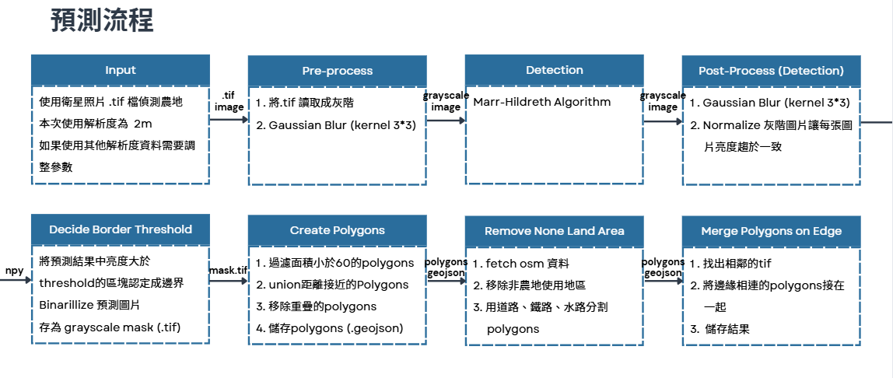
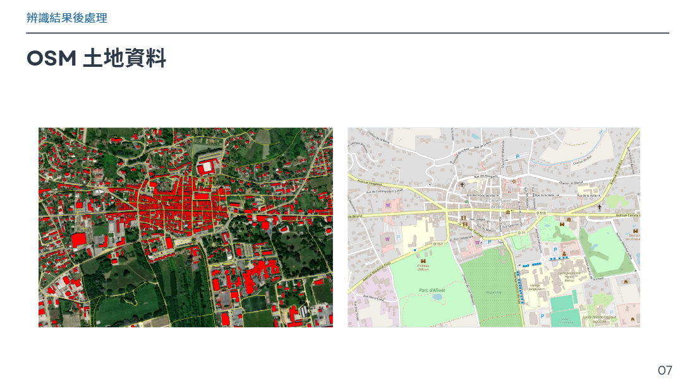
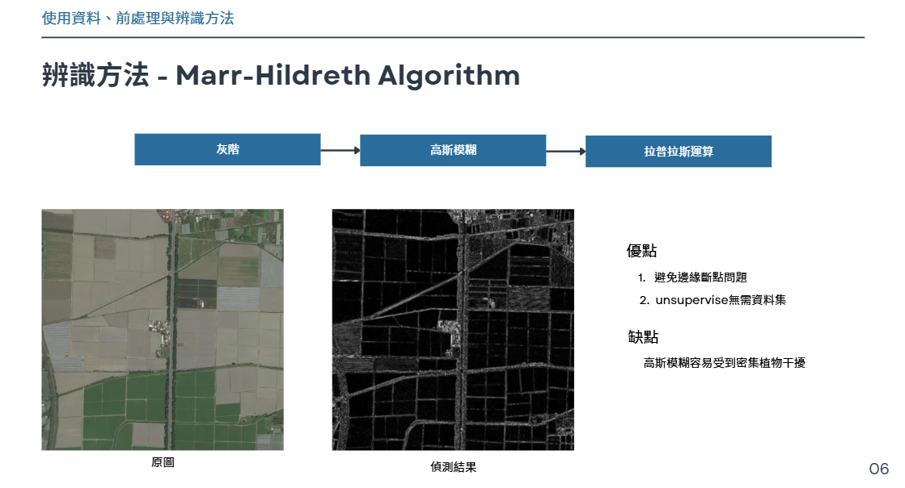
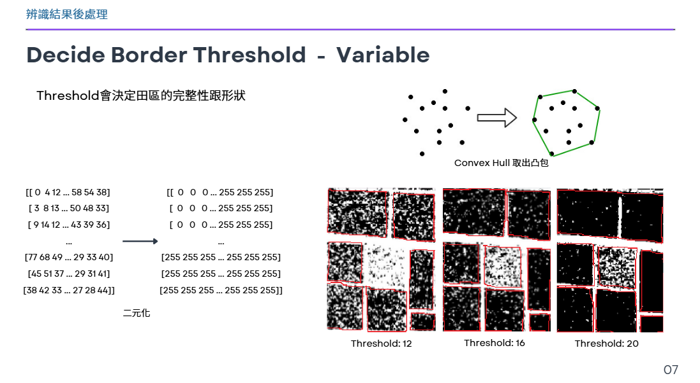
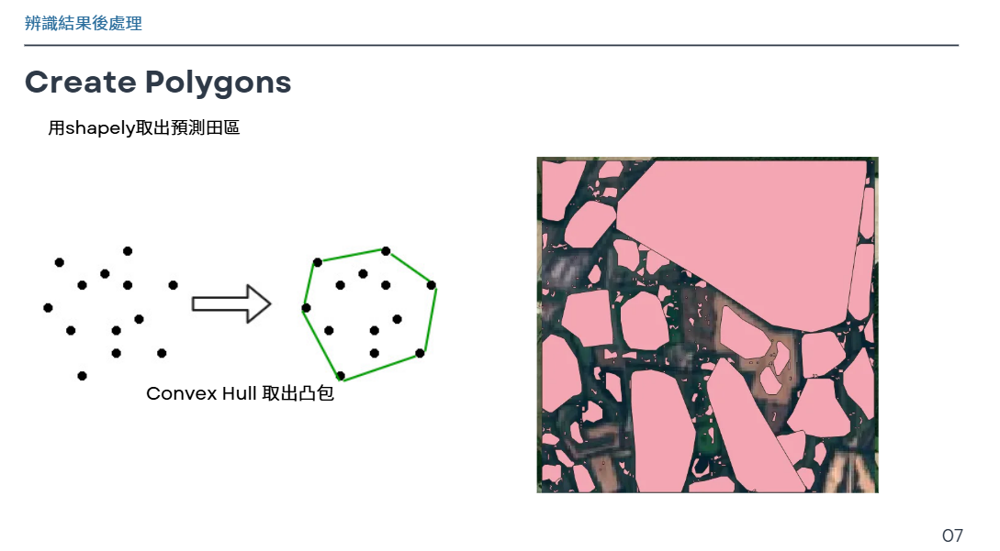
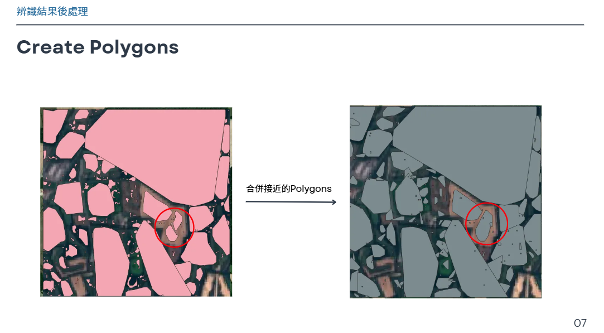
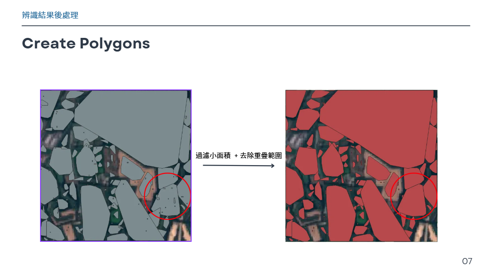
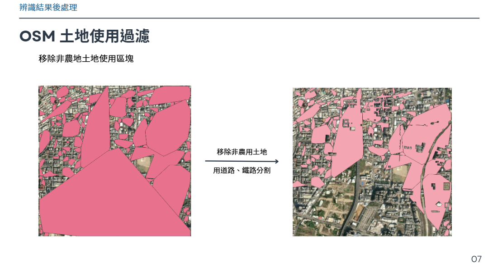
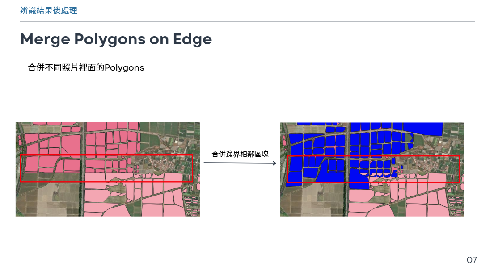

# **AI框田**

用衛星資料偵測田區邊界

---

## **專案簡介**

輸入 `.tif` 檔，使用Marr-Hildreth偵測邊界，透過後處理生成農地的 `geojson`檔

---

## **處理流程**



---

## **安裝與環境設置**

### **必要條件**

如 `pyproject.toml`

### **安裝步驟**

安裝依賴：

```bash
    poetry install
```

---

## **使用方法**

### **準備資料**

在root建立 `./data`資料夾，將2m*2m的影像資料夾放入，如:

```
    ./data
    ├── /Taiwan  
    │   ├── img1.tif
    │   ├── img2.tif
    │   ├── img3.tif
    │   └── ...
```

### **執行程式**

```bash
    python main.py
```

   輸出結果會在 `./geojsons/combined`資料夾中，如:

```
    ./geojsons
    ├── /combined
    │   ├── img1.geojson
    │   ├── img2.geojson
    │   ├── img3.geojson
    │   └── ...
```

---

## **文件結構**

### **主要程式碼**



`./border_detection/osm_fetcher.py` : 讀取OSM資料

---



`./border_detection/borderdetection.py` : 前處理, Marr-Hildreth邊界偵測, 產生 `./pred_gray/{source_data_folder_name/}`

---



`./border_detection/npy2mask.py` : 後處理, npy轉mask, 二元化, 產生 `./gray_mask/{source_data_folder_name}/`

---







`./border_detection/mask2geojson.py` : 後處理, mask轉geojson, 過濾小面積、合併圖內相近的多邊形、移除重疊, 產生 `./geojsons/{source_data_folder_name/to_be_processed}`

---



`./border_detection/remove_none_land_area.py` : 後處理, 移除非農地區域, 用道路、鐵路、水路分割資料, 產生 `./geojsons/{source_data_folder_name}/removed`

---



`./border_detection/border_polygon_merger.py` : 後處理, 合併不同圖片相接處的多邊形, 產生 `./geojsons/{source_data_folder_name}/combined`

---
